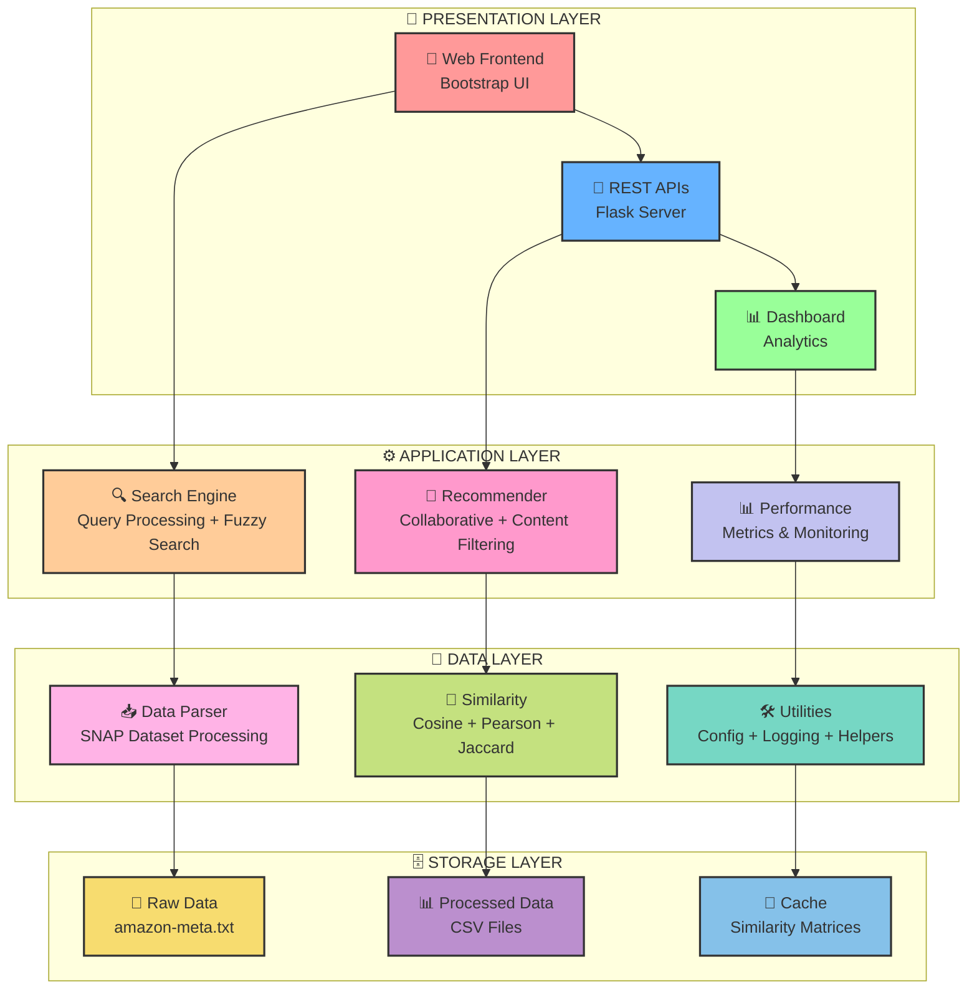
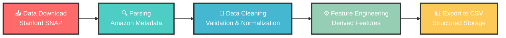

<div align="center">

# 🛍️ Amazon Recommender System

<p align="center">
  
</p>

<p align="center">
  
  
  
  
</p>

<p align="center">
  
  
  
</p>

<p align="center">
  
  
  
  
</p>


</div>

## 🎯 About The Project

A comprehensive data analytics engine for Amazon product data with advanced search capabilities and intelligent recommendation algorithms. This project leverages big data processing, algorithmic computing, and modern web technologies to create a scalable and production-ready recommendation system.

This project implements a sophisticated recommender system using Amazon metadata from the SNAP Stanford dataset, containing over 514K products and 7 million user reviews. The large-scale dataset enables deep insights into customer preferences, product relationships, and personalized recommendations. The system is designed with enterprise-level architecture principles, incorporating microservices design patterns, containerization (Docker), and cloud deployment capabilities (AWS Elastic Beanstalk) to ensure scalability, modularity, and real-world production readiness.

<div align="center">
  
</div>

## ✨ Key Features

<table>
<tr>
<td width="50%">

### 🔍 **Advanced Search Engine**
- 🧮 Mathematical Query Processing (`>`, `<`, `>=`, `<=`, `==`, `!=`)
- 🎯 Multi-dimensional Search (category, brand, price, rating)
- 🔤 Fuzzy Search with intelligent text matching
- 📊 Dynamic Best Sellers Analysis

</td>
<td width="50%">

### 🤖 **AI-Powered Recommendations**
- 👥 User-based Collaborative Filtering
- 📦 Item-based Collaborative Filtering
- 🧬 Content-Based Filtering
- 🔄 Hybrid Recommendation Engine

</td>
</tr>
<tr>
<td width="50%">

### 📊 **Real-time Analytics**
- ⚡ Performance Dashboard
- 👤 User Engagement Tracking
- 💾 Resource Monitoring
- 📈 Response Time Analysis

</td>
<td width="50%">

### 🌐 **Modern Web Interface**
- 📱 Responsive Bootstrap UI
- 🔍 Interactive Search
- 🎨 Personalized Recommendations
- 📊 Analytics Dashboard

</td>
</tr>
</table>

<div align="center">
  
</div>

## 🏗️ System Architecture

<div align="center">
  
</div>

### 🎨 System Architecture Diagram



### 💻 Technology Stack

<div align="center">

| **Category** | **Technologies** |
|--------------|------------------|
| **Backend** |     |
| **Algorithms** |   |
| **Frontend** |     |
| **DevOps** |   |

</div>

## 📁 Project Structure

<div align="center">
  
</div>

<details>
<summary><b>🗂️ Click to explore project structure</b></summary>

```
🛍️ amazon-recommender-system/
├── 🚀 web/                          # Web application layer
│   ├── 🎯 app.py                    # Flask application entry point
│   └── 🎨 templates/                # HTML templates
│       ├── 🏠 index.html           # Landing page
│       ├── 🔍 search.html          # Search interface
│       ├── 🎯 recommendations.html  # Recommendation display
│       └── 📊 analytics.html       # Analytics dashboard
│
├── 🔧 src/                          # Core application logic
│   ├── 📊 data_processing/         # Data ingestion and processing
│   │   ├── 📥 download_data.py      # SNAP dataset downloader
│   │   └── 🔄 parse_stanford_snap.py # Amazon metadata parser
│   │
│   ├── 🔍 search/                   # Search engine module
│   │   ├── 🎯 search_engine.py      # Main search functionality
│   │   └── ⚙️ query_processor.py    # Query parsing and processing
│   │
│   ├── 🤖 recommendation/           # Recommendation algorithms
│   │   ├── 👥 collaborative_filter.py # Collaborative filtering
│   │   ├── 🧮 similarity.py        # Similarity calculations
│   │   └── 🚀 large_scale_recommender.py # Scalable recommendations
│   │
│   └── 🛠️ utils/                    # Utility modules
│       ├── ⚙️ config.py            # Configuration management
│       ├── 🔧 helpers.py           # Helper functions
│       └── 📊 performance_dashboard.py # Performance monitoring
│
├── 📁 data/                         # Data storage
│   ├── 📄 raw/                     # Original SNAP dataset
│   └── 📊 processed/               # Cleaned and processed data
│
├── 🧪 tests/                        # Test suites
├── 📜 logs/                         # Application logs
├── 🐳 Dockerfile                    # Container configuration
└── ⚙️ Configuration Files
```

</details>

<div align="center">
  
</div>

## 🚀 Quick Start Guide

<div align="center">
  
</div>

### 📋 Prerequisites

<table>
<tr>
<td>

**Required**
- 🐍 Python 3.10+
- 📦 pip package manager
- 🌐 Git

</td>
<td>

**Optional**
- 🐳 Docker
- ☁️ AWS CLI
- 🔧 Virtual Environment

</td>
</tr>
</table>

### ⚡ Installation

<details>
<summary><b>🔧 Method 1: Standard Installation</b></summary>

```bash
# 1️⃣ Clone the repository
git clone https://github.com/Syam-1133/Amazon-Recommender-System.git
cd Amazon-Recommender-System

# 2️⃣ Create virtual environment
python3 -m venv venv
source venv/bin/activate  # On Windows: venv\Scripts\activate

# 3️⃣ Install dependencies
pip install -r requirements.txt

# 4️⃣ Download and process data
python src/data_processing/download_data.py
python src/data_processing/parse_stanford_snap.py

# 5️⃣ Launch the application
export FLASK_APP=web/app.py
export PYTHONPATH=src
python web/app.py
```

</details>

<details>
<summary><b>🐳 Method 2: Docker Installation</b></summary>

```bash
# 1️⃣ Clone and enter directory
git clone https://github.com/Syam-1133/Amazon-Recommender-System.git
cd Amazon-Recommender-System

# 2️⃣ Build Docker image
docker build -t amazon-recommender .

# 3️⃣ Run container
docker run -p 5000:5000 amazon-recommender

# 🎉 Access at http://localhost:5000
```

</details>

<div align="center">
  
### 🌐 **Access Your Application**

**Local Development:** `http://localhost:5000`


</div>

## 🔧 Configuration

<div align="center">
  
</div>

<details>
<summary><b>⚙️ Configuration Options</b></summary>

The system is highly configurable through `src/utils/config.py`:

```python
# 🔍 Search Engine Configuration
SEARCH_CONFIG = {
    "max_results": 100,
    "default_page_size": 20,
    "enable_fuzzy_search": True,
    "similarity_threshold": 0.7
}

# 🤖 Recommender System Configuration
RECOMMENDER_CONFIG = {
    "min_interactions": 5,
    "n_recommendations": 10,
    "similarity_metric": "cosine",
    "enable_hybrid": True
}

# 🌐 Web Application Configuration
WEB_CONFIG = {
    "port": 5000,
    "debug": False,
    "threaded": True
}
```

</details>

<div align="center">
  
</div>

## 🎯 Core Algorithms & Implementation

<div align="center">
  
</div>

### 🤖 Algorithm Showcase

<details>
<summary><b>👥 Collaborative Filtering Algorithm</b></summary>

Implements both **user-based** and **item-based** collaborative filtering:

```python
def recommend_user_based(self, user_id, n_recommendations=10):
    """
    🎯 Generate recommendations based on similar users
    
    Algorithm Steps:
    1️⃣ Find users similar to target user
    2️⃣ Identify items liked by similar users  
    3️⃣ Rank items by weighted preference scores
    4️⃣ Return top N recommendations
    """
```

**🧮 Mathematical Foundation:**
- **Cosine Similarity**: `sim(u,v) = (u·v) / (||u|| × ||v||)`
- **Pearson Correlation**: For user preference correlation
- **Jaccard Index**: For binary interaction data

</details>

<details>
<summary><b>🔍 Advanced Search Engine</b></summary>

```python
def process_query(self, query_params):
    """
    🔍 Process complex queries with mathematical operators
    
    Supports:
    📊 Mathematical: price > 50, rating >= 4.5, reviews <= 100
    🔤 Boolean: AND, OR, NOT operations
    🎯 Fuzzy: String matching with similarity scores
    """
```

</details>

<details>
<summary><b>⚡ Performance Optimization</b></summary>

- **🗂️ Sparse Matrices**: Memory-efficient storage for user-item interactions
- **🏃 Vectorized Operations**: NumPy-based computations for speed  
- **💾 Caching**: Frequent query result caching
- **📦 Batch Processing**: Efficient large-dataset handling

</details>

## 📊 Data Pipeline

<div align="center">
  
</div>

### 📈 Dataset Overview

<div align="center">

| **Metric** | **Count** | **Description** |
|------------|-----------|-----------------|
| 🛍️ **Products** |  | Unique Amazon products |
| ⭐ **Reviews** |  | Customer reviews and ratings |
| 🔗 **Co-purchases** |  | Product co-purchasing relationships |

</div>

### 🔄 Data Processing Pipeline

<div align="center">



**Pipeline Steps:**
1. **📥 Data Download**: Automated retrieval from Stanford SNAP Amazon dataset
2. **🔍 Parsing**: Custom parser for Amazon metadata format processing
3. **🧹 Data Cleaning**: Validation, normalization, and quality checks
4. **⚙️ Feature Engineering**: Creation of derived features for recommendations
5. **📊 Export**: Generation of structured CSV files for efficient access

</div>

<details>
<summary><b>📋 Data Schema Details</b></summary>

#### 🛍️ Products Schema (`amazon_products.csv`)
```csv
product_id,title,group,salesrank,similar_count,categories,avg_rating,total_reviews
```

#### ⭐ Reviews Schema (`amazon_reviews.csv`)
```csv
product_id,customer_id,rating,helpful_votes,total_votes,date
```

#### 🏷️ Categories Schema (`amazon_categories.csv`)
```csv
product_id,category_id,category_name,category_path
```

</details>

## � API Documentation

<div align="center">
  
</div>

### 📡 REST API Endpoints

<details>
<summary><b>🔍 Search APIs</b></summary>

```http
POST /api/search
Content-Type: application/json

{
  "query": "digital camera",
  "category": "Electronics", 
  "min_rating": 4.0,
  "max_price": 500,
  "limit": 20
}
```

**Response:**
```json
{
  "status": "success",
  "results": [...],
  "total_found": 156,
  "query_time": "45ms"
}
```

</details>

<details>
<summary><b>🎯 Recommendation APIs</b></summary>

| **Endpoint** | **Method** | **Description** |
|--------------|------------|-----------------|
| `/api/recommendations/{user_id}` | `GET` | 🎯 Personal recommendations |
| `/api/co_purchasing/{user_id}` | `GET` | 🛒 Co-purchasing analysis |
| `/api/best_sellers/{category}` | `GET` | 🏆 Category best sellers |

</details>

<details>
<summary><b>📊 Analytics APIs</b></summary>

| **Endpoint** | **Description** | **Response** |
|--------------|-----------------|--------------|
| `/api/stats` | 📈 System statistics | User count, product metrics |
| `/api/dashboard` | 📊 Performance metrics | Real-time system data |
| `/api/categories` | 🏷️ Available categories | Category list |

</details>

## 📈 Performance Metrics

<div align="center">
  
</div>

### ⚡ System Performance

<div align="center">

| **Metric** | **Performance** | **Status** |
|------------|-----------------|------------|
| 🔍 **Search Response** |  |  |
| 🎯 **Recommendation Generation** |  |  |
| 👥 **Concurrent Users** |  |  |
| 💾 **Memory Usage** |  |  |

</div>

### 🎯 Recommendation Quality Metrics

<details>
<summary><b>📊 Quality Indicators</b></summary>

- **📍 Precision@10**: Measures recommendation accuracy in top 10 results
- **📊 Coverage**: Percentage of catalog items that get recommended  
- **🎨 Diversity**: Variety across different product categories
- **✨ Novelty**: Introduction of new/unknown products to users

</details>

<div align="center">
  
</div>

## 🧪 Testing & Quality Assurance

<div align="center">
  
</div>

### 🔬 Test Suite

<details>
<summary><b>🧪 Run Tests</b></summary>

```bash
# Run comprehensive test suite
python -m pytest tests/test_system.py -v

# Run with coverage report
pytest --cov=src tests/ --cov-report=html
```

</details>

### ✅ Test Coverage Areas

<div align="center">

| **Test Type** | **Coverage** | **Description** |
|---------------|--------------|-----------------|
| 🔬 **Unit Tests** |  | Individual component testing |
| 🔗 **Integration** |  | End-to-end workflow testing |
| ⚡ **Performance** |  | Load and stress testing |
| 🌐 **API Tests** |  | REST endpoint validation |

</div>

## 🚀 Deployment Options

<div align="center">
  
</div>

### 🌐 Deployment Strategies

<details>
<summary><b>🔧 1. Local Development</b></summary>

```bash
# Quick start for development
python web/app.py
```

**Ideal for:** Development, testing, debugging

</details>

<details>
<summary><b>🐳 2. Docker Container</b></summary>

```bash
# Containerized deployment
docker build -t amazon-recommender .
docker run -p 5000:5000 amazon-recommender
```

**Ideal for:** Consistent environments, easy deployment

</details>

<details>
<summary><b>☁️ 3. AWS Elastic Beanstalk</b></summary>

```bash
# Cloud deployment
eb init
eb create
eb deploy
```

**Ideal for:** Production, scalability, managed infrastructure

</details>

### 🏭 Production Considerations

<div align="center">

| **Component** | **Recommendation** | **Purpose** |
|---------------|-------------------|-------------|
| 🔄 **Load Balancing** | Multiple instances | High availability |
| 🗄️ **Database** | PostgreSQL/MongoDB | Production data storage |  
| ⚡ **Caching** | Redis | Performance optimization |
| 📊 **Monitoring** | CloudWatch/New Relic | System observability |

</div>

##  Troubleshooting Guide

<details>
<summary><b>🔧 Common Issues & Solutions</b></summary>

### **1️⃣ Data Download Fails**
```bash
# Check network connection and retry with force
python src/data_processing/download_data.py --force-download
```

### **2️⃣ Memory Issues with Large Dataset**
```python
# Adjust configuration in config.py
RECOMMENDER_CONFIG = {
    "max_users": 10000,  # Reduce for memory constraints
    "max_items": 10000
}
```

### **3️⃣ Slow Recommendation Generation**
- ✅ Enable caching in configuration
- ✅ Use sampling for large user bases  
- ✅ Consider item-based over user-based filtering

</details>

## 🤝 Contributing

<div align="center">
  
</div>

We welcome contributions from the community! 🎉

### 🚀 How to Contribute

<details>
<summary><b>🔧 Quick Contribution Guide</b></summary>

1. **🍴 Fork** the repository
2. **🌿 Create** a feature branch: `git checkout -b feature/amazing-feature`  
3. **💫 Commit** your changes: `git commit -m 'Add amazing feature'`
4. **📤 Push** to branch: `git push origin feature/amazing-feature`
5. **🔀 Open** a Pull Request

</details>

### 📋 Development Guidelines

<div align="center">

| **Guideline** | **Requirement** |
|---------------|-----------------|
| 🐍 **Code Style** |  |
| 📝 **Documentation** |  |
| 🧪 **Testing** |  |
| 📖 **Updates** |  |

</div>

### 🌟 Contributors

<div align="center">
  <a href="https://github.com/Syam-1133/Amazon-Recommender-System/graphs/contributors">
    
  </a>
</div>

## 📚 Academic References & Research

<div align="center">
  
</div>

<details>
<summary><b>📖 Key Research Papers</b></summary>

- **📊 Collaborative Filtering**: Breese, J.S., Heckerman, D., & Kadie, C. (1998)
- **🎯 Recommender Systems**: Ricci, F., Rokach, L., & Shapira, B. (2011)  
- **🗂️ SNAP Dataset**: Leskovec, J., & Krevl, A. (2014)
- **🧮 Matrix Factorization**: Koren, Y., Bell, R., & Volinsky, C. (2009)

</details>

## 📄 License

<div align="center">
  
</div>

This project is licensed under the **MIT License** - see the [LICENSE](LICENSE) file for details.

## 👨‍💻 Meet the Developer

<div align="center">

### **Syam Gudipudi** 🚀


<p align="center">
  <a href="https://github.com/Syam-1133">
    
  </a>
  <a href="https://linkedin.com/in/syam-gudipudi">
    
  </a>
  <a href="mailto:syamgudipudi@example.com">
    
  </a>
</p>

**Passionate Data Scientist & Software Engineer**  
*Building intelligent systems that make a difference* ✨

</div>

## 🙏 Acknowledgments

<div align="center">

**Special Thanks To:**

🎓 **Stanford SNAP** - For providing the comprehensive Amazon dataset  
🌐 **Flask Community** - For the robust web framework  
🤖 **Scikit-learn** - For mathematical algorithms and similarity computations  
🎨 **Bootstrap** - For beautiful, responsive UI components  
🐍 **Python Community** - For the amazing ecosystem

</div>

## 📊 Project Statistics

<div align="center">


<p align="center">
  
  
  
  
</p>


</div>

---

<div align="center">
  
  
  <h3>🛍️ Built with ❤️ by Syam Gudipudi</h3>
  
  <p><em>This project demonstrates advanced concepts in algorithmic computing, data processing, and web development, showcasing real-world application of recommendation systems in e-commerce.</em></p>
  
  
  
</div>